# fitbit+

Own your Fitbit / Pixel health data. fitbit+ syncs it from the **Google Health API**
into a local SQLite file, computes transparent versions of the "Premium" metrics
(readiness, sleep score, training load), and puts a dashboard, an insights engine,
and a **zero-cost AI coach** on top — all running on your machine, with your data
never leaving it except to talk to Google.

> The Google Health API replaces the legacy Fitbit Web API (full shutdown Sept 2026).
> This project is built for **personal, single-user** use: your OAuth consent screen
> runs in *Testing* mode with yourself as the only test user, so there's no
> third-party security review and no server-side anything.

## The tour

*(All real data — mine. That's rather the point.)*

**Overview** — the day's readiness, what's driving it, the 28-day strip, and your goals right below:

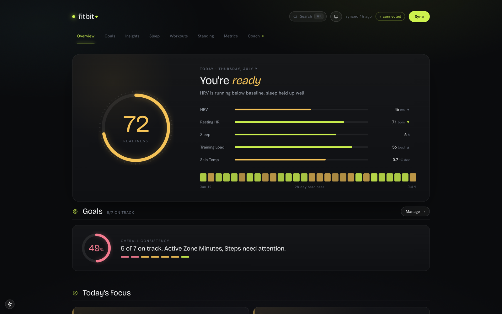

**The AI coach** answers with live widgets, not prose about numbers. Ask to *see* something
and it renders the chart inline — here: a metric-history chart, a stat tile, and a peer-benchmark
band, all from one question, each fetched live by the frontend:

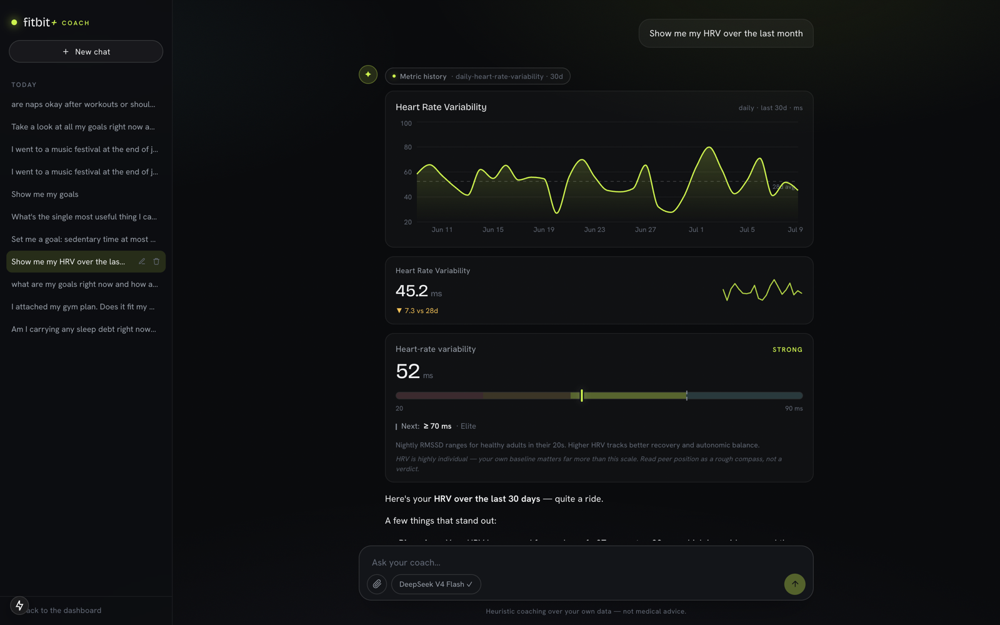

Follow-ups keep the session: it reads the engine (see the tool chips), overlays two metrics on a
dual-axis chart, and reasons about what moved what — honestly (`r = -0.50` is an association,
and it says so). Next to it, the **daily briefing**: after each sync, an analyst model turns the
computed evidence into a morning read:

<p>
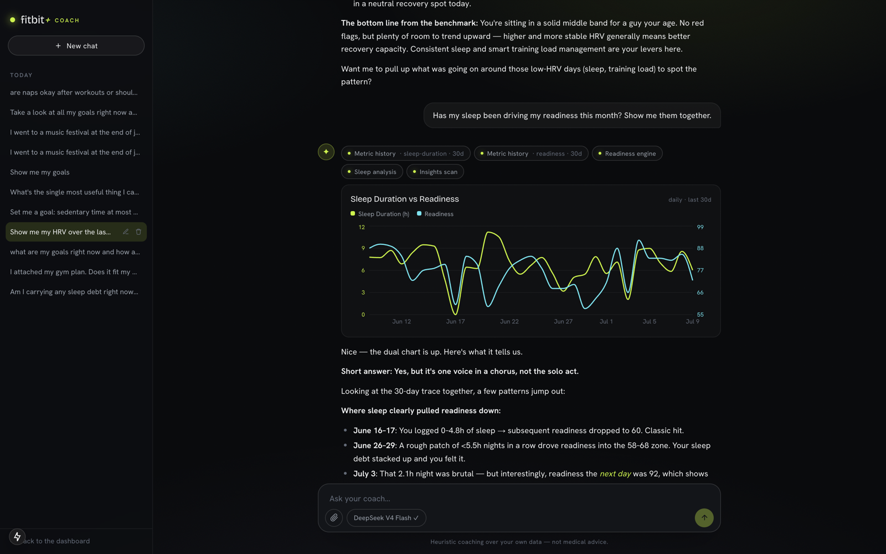
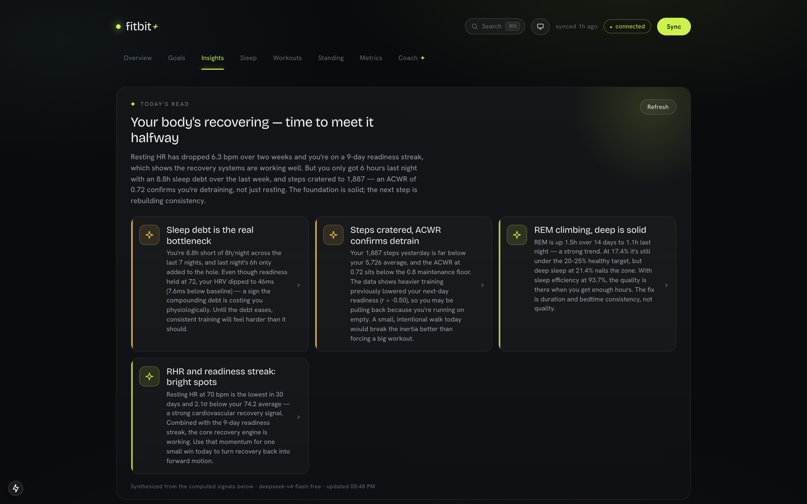
</p>

**Every metric drills down** (30/90-day stats, personal best, baseline) and **⌘K jumps anywhere**
— fuzzy search over all 40 registered metrics, with live sparklines in the results:

<p>
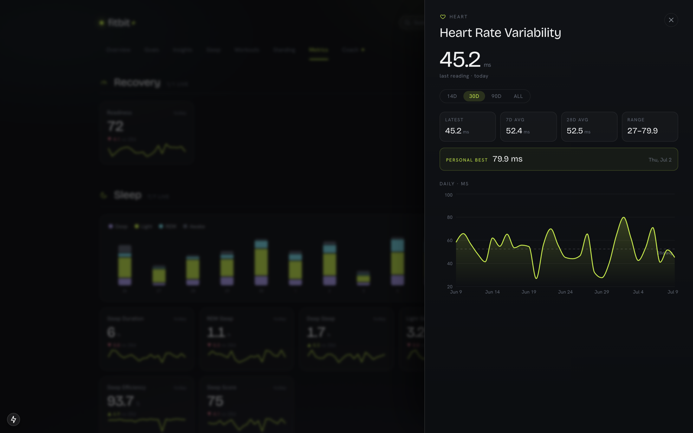
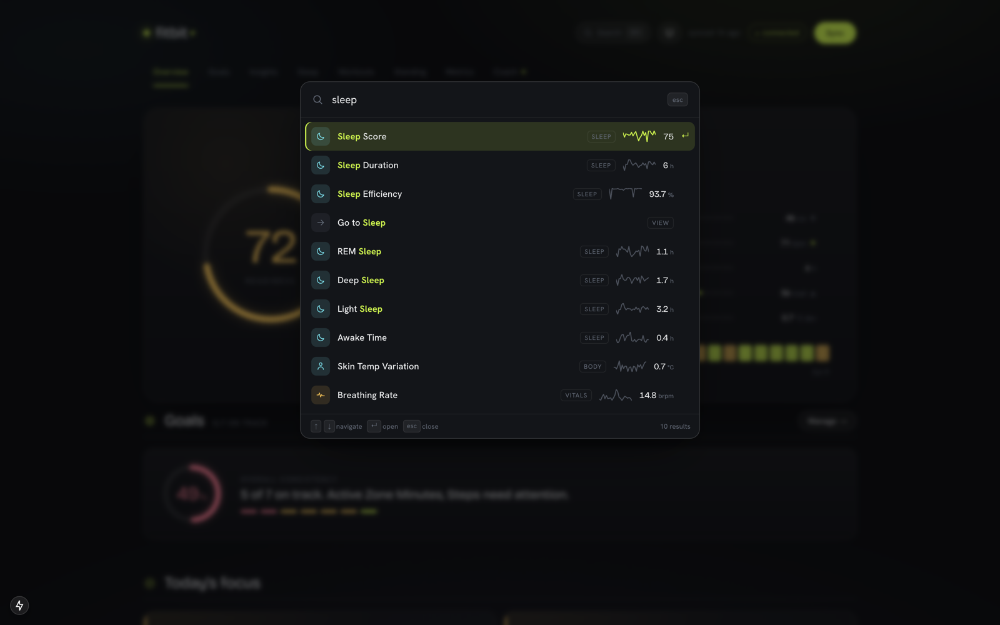
</p>

**Sleep deep-dive** (stage mix vs evidence-based targets, 14-night debt, consistency) and
**Standing** — where you sit on cited reference bands, each with the next rung to reach for:

<p>
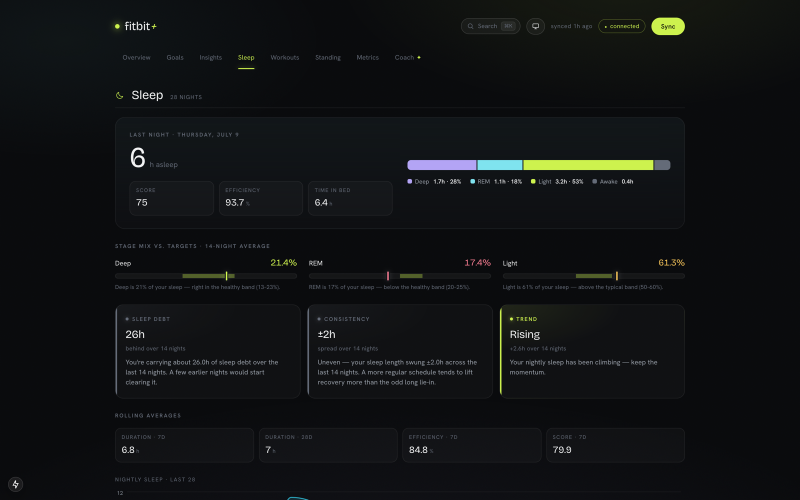
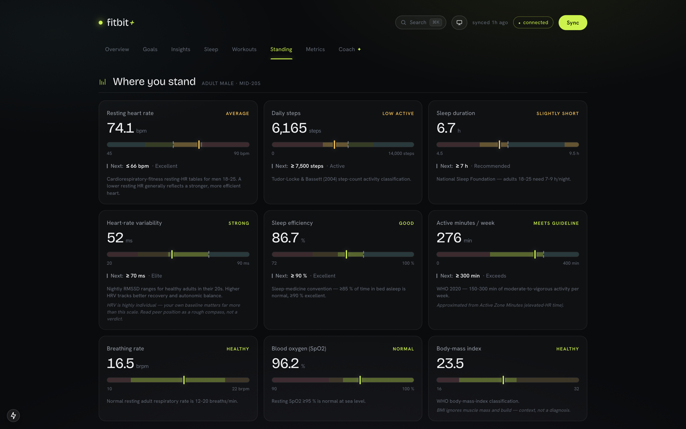
</p>

**Workouts** (weekly volume, activity mix, every synced session) and **Goals** with streaks and
28-day adherence, sorted worst-first so the work finds you:

<p>
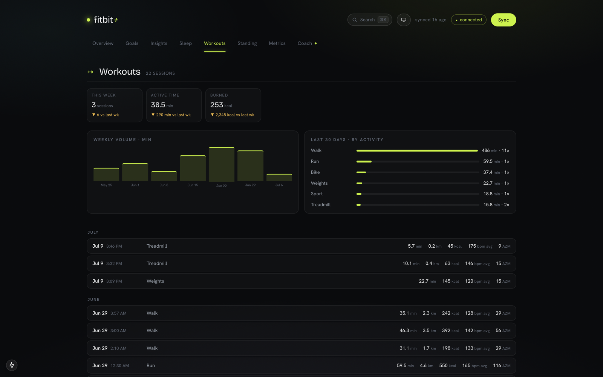
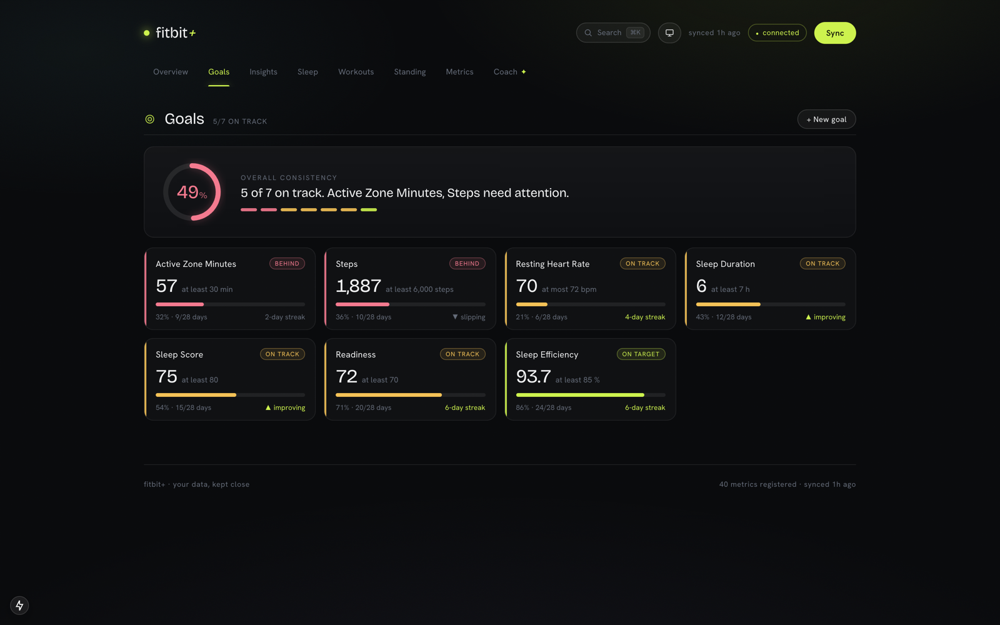
</p>

And yes, it does light mode — system-detected with a manual toggle:

<p>
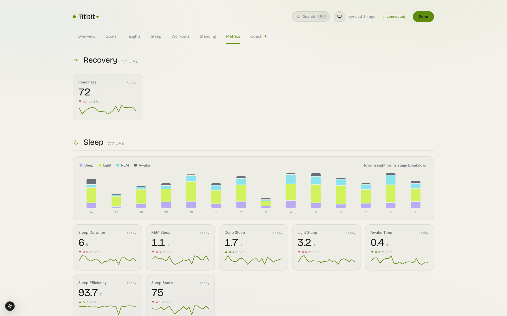
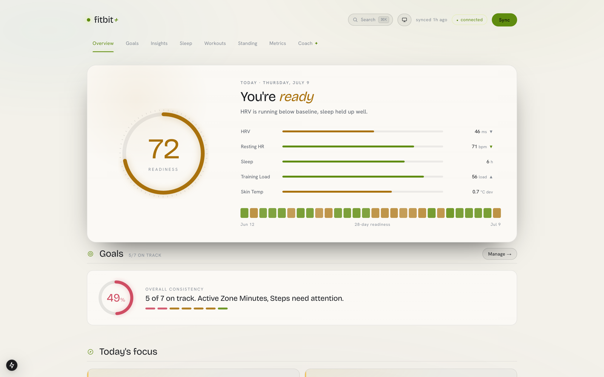
</p>

## What's inside

- **Sync engine** — incremental per-type watermarks over 30+ Google Health data types:
  daily rollups, intraday samples (sub-minute heart rate, SpO2, HRV), and full
  sleep / exercise sessions, including per-workout detail.
- **Dashboard** (Next.js) — Overview with a readiness hero and your goals, then
  Insights, Sleep deep-dive, Workouts, Standing (peer benchmarks), and a Metrics
  drill-down for every synced type. Light/dark themes, ⌘K command palette, and
  deep-linkable state (`?v=` view, `?m=` metric drawer, `/coach?c=` conversation,
  `?theme=` override).
- **Derived metrics, formulas in the open** — Readiness (0–100 recovery index vs your
  own 28-day baseline), Sleep Score, TRIMP-style Cardio Load. Every threshold and
  weighting traces to a citation in [`docs/health-metrics-spec.md`](docs/health-metrics-spec.md).
- **Insights engine** — deterministic detectors: trends, z-score anomalies, ACWR
  training-load balance, 14-night sleep debt, Spearman correlations (honestly framed
  as associations), goal streaks, and a vitals early-warning that only fires when ≥2
  vitals drift together.
- **AI coach** (`/coach`) — a ChatGPT-style chat over *your* data: conversation
  history, attachments, model picker, streaming replies with **inline generative
  widgets** (charts, comparisons, readiness ring, sleep stages, benchmark bands,
  goals). The coach can also create, update, and delete your goals.
- **Daily briefing** — after each sync, an analyst model turns the day's computed
  evidence into a morning read: headline, narrative, and 3–5 insight cards, every
  number traceable back to the evidence pack.

## How the AI layer works (and why it costs $0)

```
Next.js chat UI ──SSE──▶ FastAPI /api/chat ──subprocess──▶ opencode run (free Zen models)
                                                                 │ MCP (stdio)
                                                                 ▼
                                            backend/mcp_server.py — 21 typed tools
                                                                 │
                                                                 ▼
                                            SQLite + the deterministic analysis engine
```

- The app **never holds an LLM API key**. It shells out to the [opencode](https://opencode.ai)
  CLI you're already logged into, using opencode Zen's free models — so an entire
  coach conversation costs exactly $0.
- `backend/mcp_server.py` exposes the analysis engine as **21 MCP tools** (11 read,
  3 goal-write, 7 display). Metric arguments are closed enums generated from the
  data-type registry, so the model *cannot* hallucinate a metric name.
- **The LLM orchestrates and narrates; it never does the math.** Trends, anomalies,
  correlations, and scores all come from the deterministic engine — the model's job
  is to call the right tools and explain the results.
- Display tools (`show_chart`, `show_readiness`, …) return only an acknowledgement;
  the SSE bridge turns them into widget events and the frontend renders live Recharts
  components in place, exactly where the model called them.
- The briefing is the same idea inverted: the engine computes an evidence pack, a
  tool-less analyst agent returns strict JSON, the backend validates it (real metric
  names, capped cards) and caches it by evidence digest so unchanged data never
  re-generates.

## Setup

### 1. Google Cloud (one time)

1. **Migrate your Fitbit account to a Google account** (mandatory by 2026-05-19 anyway).
2. In [Google Cloud Console](https://console.cloud.google.com):
   - Create a project and **enable the Google Health API**.
   - Configure the **OAuth consent screen**: User type *External*, publishing status
     left at **Testing**, and add your own email under **Test users**.
   - Create an **OAuth client ID** (type *Web application*) with redirect URI
     `http://localhost:8400/auth/callback` (must match `oauth_redirect_uri` in
     `backend/.env`). Download the JSON.
3. Save the downloaded file as `backend/credentials.json` (gitignored).

> ⚠️ **Testing-mode caveat:** refresh tokens expire after **7 days**. The sync exits
> with code 2 when that happens, and the daily briefing warns you *before* it does.
> That's the trade-off for skipping Google's security review — fine for a personal
> archive.

### 2. Backend

```bash
cd backend
python3 -m venv .venv && source .venv/bin/activate   # Python 3.11+
pip install -r requirements.txt

cat > .env <<'EOF'
oauth_redirect_uri=http://localhost:8400/auth/callback
cors_origins=["http://localhost:3400","http://127.0.0.1:3400"]
EOF

python cli.py auth          # browser OAuth, stores token.json (gitignored)
python cli.py sync          # pulls everything into health.db (gitignored)

# --host :: binds IPv4 + IPv6. Without it uvicorn is IPv4-only and Safari — which
# resolves `localhost` to ::1 first — loads the dashboard but never fills it in.
uvicorn app.main:app --reload --host :: --port 8400
```

`python cli.py status` shows per-type sync watermarks; `python cli.py sync steps sleep`
syncs specific types.

### 3. Frontend

```bash
cd frontend
npm install
cp .env.example .env.local
npm run dev -- -p 3400      # dashboard at http://localhost:3400
```

### 4. AI coach (optional — everything else works without it)

```bash
# Install opencode and log in once (the free opencode Zen tier is enough):
curl -fsSL https://opencode.ai/install | bash    # or: brew install sst/tap/opencode
opencode auth login

# The MCP server needs its own venv — the `mcp` package's dependencies (newer
# starlette/pydantic) conflict with the pinned FastAPI. Do NOT install mcp into
# the main backend venv.
cd backend
python3 -m venv .venv-mcp
.venv-mcp/bin/pip install mcp pydantic-settings
```

Then point `opencode.json` (repo root) at **your** checkout — the MCP `command`
paths are absolute. The agent personas live in `.opencode/agent/`
(`fitbit-coach` for chat, `fitbit-analyst` for the briefing); both default to a
free model, and the backend falls back automatically when the free-model lineup
rotates.

### Scheduled sync (optional)

`ops/com.fitbit-plus.sync.plist` runs `cli.py sync` (which also refreshes the
briefing) every 6 hours via launchd. Edit the two absolute paths to your checkout,
then:

```bash
cp ops/com.fitbit-plus.sync.plist ~/Library/LaunchAgents/
launchctl bootstrap gui/$(id -u) ~/Library/LaunchAgents/com.fitbit-plus.sync.plist
```

Logs land in `~/Library/Logs/fitbit-plus-sync.log`; exit code 2 in the log means
the 7-day token died — re-run `python cli.py auth`.

## Repo map

```
backend/
  app/
    config.py           Settings + the data-type registry (the single source of truth)
    auth.py             Google OAuth flow, token storage, auto-refresh
    health_client.py    Thin client over the Health API (list + dailyRollUp)
    store.py            SQLite schema, upserts, query helpers
    sync.py             Incremental sync engine + derived-metric processors
    readiness.py        0–100 recovery index vs your 28-day baseline
    insights.py         Deterministic detectors (trends, anomalies, ACWR, correlations…)
    sleep_analysis.py   Stage mix vs targets, debt, consistency
    benchmarks.py       Peer-norm bands ("Standing")
    goals.py            Goal CRUD + adherence evaluation
    coach.py            Deterministic day-plan recommendations
    briefing.py         Evidence pack → analyst model → validated daily briefing
    chat.py             SSE bridge: /api/chat ↔ opencode CLI (tools → widgets)
    chat_store.py       Conversation + message persistence
  mcp_server.py         The 21 MCP tools the coach model calls
  cli.py                auth / sync / status commands
frontend/
  app/page.tsx          The dashboard (all views)
  app/coach/page.tsx    The coach chat page
  components/           chat UI, generative widgets, insights views, ⌘K palette
docs/
  health-metrics-spec.md  The cited evidence base for every formula and threshold
ops/
  com.fitbit-plus.sync.plist  launchd schedule
```

## Gotchas (hard-won)

- **Safari shows an empty dashboard** → start uvicorn with `--host ::` (dual-stack).
  Chrome silently falls back to IPv4 and hides the problem.
- **Never `pip install mcp` into the main backend venv** — it upgrades starlette past
  what the pinned FastAPI supports. That's the whole reason `.venv-mcp` exists.
- **Free-model lineup rotates** ("limited-time beta") — the backend resolves the
  configured model against what's actually available and falls back gracefully.
- **7-day tokens** — Testing-mode consent screens hard-expire refresh tokens weekly.
  Re-auth takes ~20 seconds; the briefing's first card warns you when ≤2 days remain.

## License

[MIT](LICENSE)
