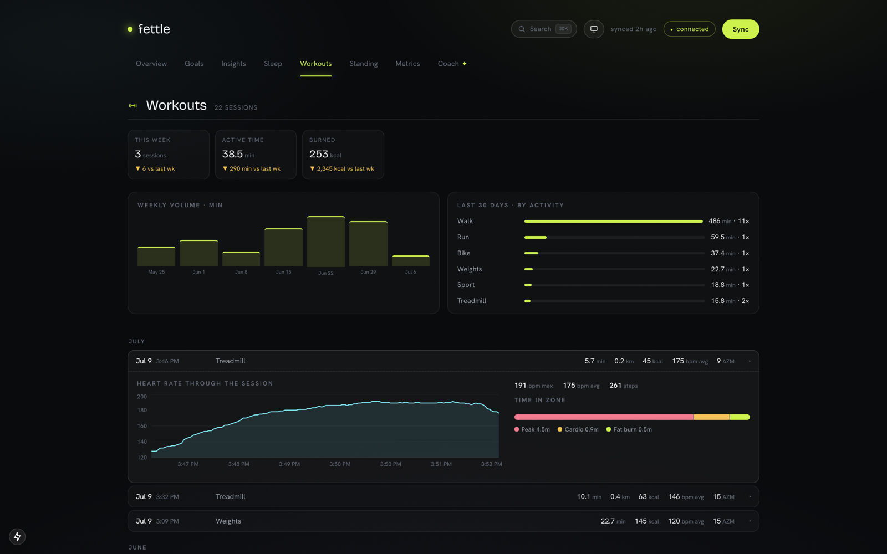
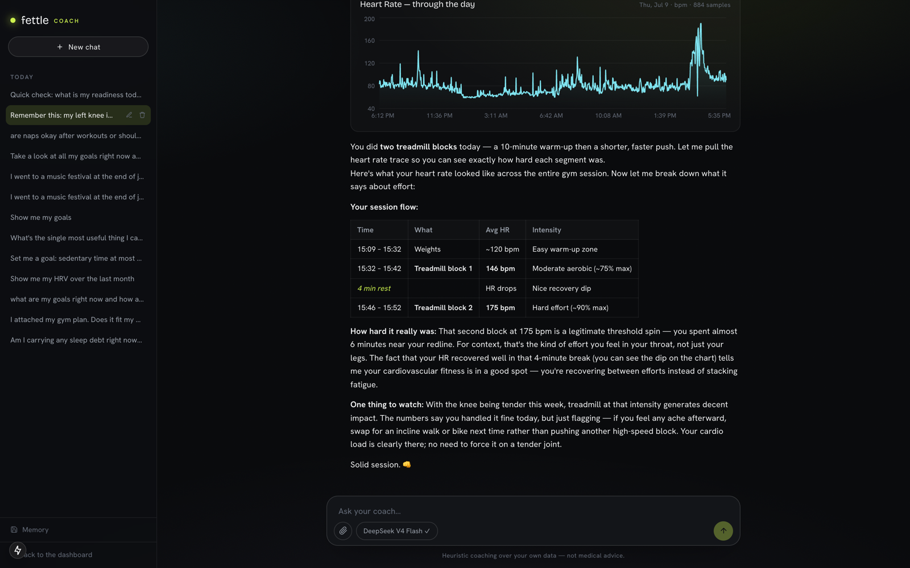
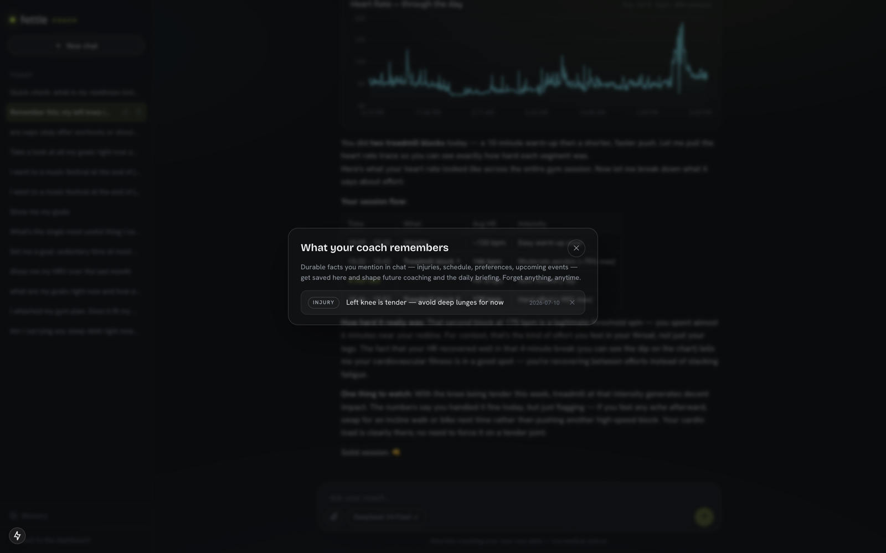
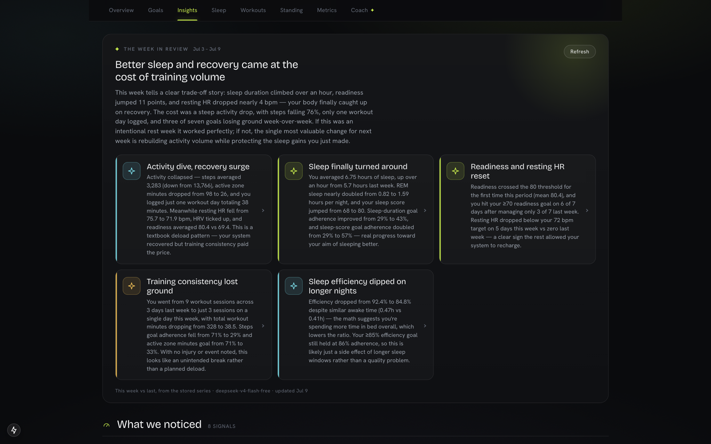

# fettle

*fettle (n.) — condition, shape: "in fine fettle."*

Own your Fitbit / Pixel health data. fettle syncs it from the **Google Health API**
into a local SQLite file, computes transparent versions of the "Premium" metrics
(readiness, sleep score, training load), and puts a dashboard, an insights engine,
and a **zero-cost AI coach** on top — all running on your machine, with your data
never leaving it except to talk to Google.

> The Google Health API replaces the legacy Fitbit Web API (full shutdown Sept 2026).
> This project is built for **personal, single-user** use: your OAuth consent screen
> runs in *Testing* mode with yourself as the only test user, so there is no
> third-party security review and no server component.

## Screenshots

All screenshots show the app running against real synced data.

**Overview** — today's readiness score, its component drivers, the 28-day history, and goal status:


**AI coach** — answers include live inline widgets. A single question here produces a
metric-history chart, a stat tile, and a peer-benchmark band, each rendered and fetched
by the frontend:


**Tool orchestration and the daily briefing** — follow-up questions continue the session.
The tool chips show each engine call behind the dual-axis comparison, and the reply frames
the correlation (`r = -0.50`) as an association, not a cause. Right: the briefing generated
after each sync from the engine's computed evidence:

<p>


</p>

**Metric drill-down and command palette** — per-metric statistics (7/28-day averages, range,
personal best) for every synced type, and ⌘K fuzzy search across all 40 registered metrics
with live sparklines in the results:

<p>


</p>

**Workout drill-down, and the coach on a session** — any session expands into its
heart-rate trace with %HRmax time-in-zone; asked about a workout, the coach pulls the
session log, renders the day's trace inline, and folds remembered context (an injury
mentioned in an earlier chat) into the advice:

<p>


</p>

**Coach memory and the weekly retrospective** — the Memory panel lists every durable
fact the coach has saved, each removable; Sundays close the week with a written
week-over-week review:

<p>


</p>

**Sleep analysis and peer benchmarks** — stage mix against published targets, 14-night sleep
debt and consistency; reference bands with the next threshold annotated and every value cited:

<p>


</p>

**Workouts and goals** — weekly volume, 30-day activity mix, and the per-session log; goal
cards with streaks and 28-day adherence, sorted by status:

<p>


</p>

**Light theme** — follows the system setting, with a manual override:

<p>


</p>

## What's inside

- **Sync engine** — incremental per-type watermarks over 30+ Google Health data types:
  daily rollups, intraday samples (sub-minute heart rate, SpO2, HRV), and full
  sleep / exercise sessions, including per-workout detail.
- **Dashboard** (Next.js) — Overview with a readiness hero and your goals, then
  Insights, Sleep deep-dive, Workouts, Standing (peer benchmarks), and a Metrics
  drill-down for every synced type. Light/dark themes, ⌘K command palette, and
  deep-linkable state (`?v=` view, `?m=` metric drawer, `/coach?c=` conversation,
  `?theme=` override).
- **Derived metrics, formulas in the open** — Readiness (0–100 recovery index vs your
  own 28-day baseline), Sleep Score, TRIMP-style Cardio Load. Every threshold and
  weighting traces to a citation in [`docs/health-metrics-spec.md`](docs/health-metrics-spec.md).
- **Insights engine** — deterministic detectors: trends, z-score anomalies, ACWR
  training-load balance, 14-night sleep debt, Spearman correlations (honestly framed
  as associations), goal streaks, and a vitals early-warning that only fires when ≥2
  vitals drift together.
- **Workout drill-down** — every session row expands into its intraday heart-rate
  trace, %HRmax time-in-zone, and a comparison against your median session of that
  activity.
- **AI coach** (`/coach`) — a ChatGPT-style chat over *your* data: conversation
  history, attachments, model picker, streaming replies with **inline generative
  widgets** (charts, comparisons, intraday traces, readiness ring, sleep stages,
  benchmark bands, goals). The coach can create, update, and delete your goals —
  and it **remembers**: durable facts you mention (injuries, schedule, events) are
  saved, recalled at the start of each conversation, and listed in a Memory panel
  you can prune anytime.
- **Daily briefing + weekly retrospective** — after each sync, an analyst model
  turns the day's computed evidence into a morning read (headline, narrative, 3–5
  cards, every number traceable). Yesterday's briefing rides along as context, so
  narratives continue instead of restarting. Sundays add a week-over-week
  retrospective: what changed, which goals moved, one thing to fix next week.
- **Notifications** — after a scheduled sync, macOS notifications fire only when
  something needs you: the 7-day token is about to die, several vitals drift
  together, or a goal streak you'd built breaks.

## How the AI layer works

```
Next.js chat UI ──SSE──▶ FastAPI /api/chat ──subprocess──▶ opencode run (free Zen models)
                                                                 │ MCP (stdio)
                                                                 ▼
                                            backend/mcp_server.py — 25 typed tools
                                                                 │
                                                                 ▼
                                            SQLite + the deterministic analysis engine
```

- The app **never holds an LLM API key**. It shells out to the [opencode](https://opencode.ai)
  CLI you're already logged into, using opencode Zen's free models, so there is no
  per-conversation cost.
- `backend/mcp_server.py` exposes the analysis engine as **25 MCP tools** (12 read,
  5 write — goals and memory — and 8 display). Metric arguments are closed enums
  generated from the data-type registry, so the model *cannot* hallucinate a
  metric name.
- **The LLM orchestrates and narrates; it never does the math.** Trends, anomalies,
  correlations, and scores all come from the deterministic engine — the model's job
  is to call the right tools and explain the results.
- Display tools (`show_chart`, `show_readiness`, …) return only an acknowledgement;
  the SSE bridge turns them into widget events and the frontend renders live Recharts
  components in place, exactly where the model called them.
- The briefing is the same idea inverted: the engine computes an evidence pack, a
  tool-less analyst agent returns strict JSON, the backend validates it (real metric
  names, capped cards) and caches it by evidence digest so unchanged data never
  re-generates.

## Setup

Prerequisite: a Fitbit account migrated to Google (mandatory since 2026-05-19) with
data flowing into the Google Health / Fitbit app, plus Python 3.11+ and Node 18+.

### Quickstart

```bash
git clone https://github.com/Deekshith-Dade/fettle.git && cd fettle
ops/bootstrap.sh        # venv + all dependencies (safe to re-run)
ops/dev.sh              # backend :8400 + dashboard :3400 — Ctrl-C stops both
```

Open **http://localhost:3400**. On a fresh install the dashboard opens as a
**setup wizard** that walks you through the one-time Google part — creating your own
free Cloud project, minting an OAuth client, connecting, first sync — and checks off
each step live as you go. About ten minutes, once.

> **Why my own Google Cloud project?** Every Google Health API scope is *restricted*:
> shipping one shared app to the public would require Google's OAuth verification plus
> an annual paid security assessment. Personal apps instead use the console's
> **Testing** lane — your own project, your own keys, yourself as the only user. Your
> data flows from Google straight to your machine; no one else's server or OAuth
> client is ever involved.

> ⚠️ **The one recurring chore:** Testing-lane refresh tokens expire every **7 days**.
> The dashboard counts down in the top bar, the briefing warns you before it dies, and
> reconnecting is a one-click handshake — nothing to re-tick. A scheduled sync exits
> with code 2 when the token has died.

### What the wizard walks you through

For the curious — or the wizard-averse; every step also works headless:

1. **Create a Google Cloud project** (free, any name) and **enable the Google Health
   API** in it.
2. **OAuth consent screen**: user type *External*, publishing status left at
   **Testing**; add your own Gmail under **Test users**; under **Data access**, add
   the four `googlehealth.*.readonly` scopes (activity, health metrics, sleep,
   nutrition — the wizard has a copy-all button).
3. **Create an OAuth client** (type *Web application*) whose only authorized redirect
   URI is `http://localhost:8400/auth/callback`, and download its JSON.
4. **Hand over the JSON** — pasted or dropped into the wizard, validated (with a
   warning if the redirect URI looks wrong), stored as `backend/credentials.json`
   (gitignored).
5. **Connect Google** — one consent screen; tick every scope box.
6. **First sync** — ~90 days of dailies plus recent full-resolution intraday, then
   straight into the dashboard.

Terminal equivalent: `cd backend && .venv/bin/python cli.py auth` then `cli.py sync`;
`cli.py status` shows per-type watermarks, `cli.py sync steps sleep` syncs specific
types. Moving machines? Copy `backend/credentials.json` + `backend/token.json` across
and skip straight to sync.

### Running by hand (what dev.sh does)

```bash
cd backend  && .venv/bin/python -m uvicorn app.main:app --reload --host :: --port 8400
cd frontend && npm run dev -- -p 3400
```

`--host ::` binds IPv4 + IPv6. Without it uvicorn is IPv4-only and Safari — which
resolves `localhost` to ::1 first — loads the dashboard but never fills it in. Ports
and origins all default correctly now; `backend/.env.example` and
`frontend/.env.example` document the overrides if you need different ones.

### 4. AI coach (optional — everything else works without it)

```bash
# Install opencode and log in once (the free opencode Zen tier is enough):
curl -fsSL https://opencode.ai/install | bash    # or: brew install sst/tap/opencode
opencode auth login

# The MCP server needs its own venv — the `mcp` package's dependencies (newer
# starlette/pydantic) conflict with the pinned FastAPI. Do NOT install mcp into
# the main backend venv.
cd backend
python3 -m venv .venv-mcp
.venv-mcp/bin/pip install mcp pydantic-settings
```

Nothing else to configure: `opencode.json` (repo root) registers the MCP server with
checkout-relative paths, and the backend always launches opencode from the repo root.
(Running `opencode` by hand? Do it from the repo root so those paths resolve.) The
agent personas live in `.opencode/agent/` (`fettle-coach` for chat, `fettle-analyst`
for the briefings); both default to a free model, and the backend falls back
automatically when the free-model lineup rotates.

### Scheduled sync + notifications (optional)

```bash
ops/install-sync.sh     # generates the launchd job for this checkout and loads it
```

Syncs every 6 hours. Each run also refreshes the daily briefing (and the weekly
retrospective on Sundays), then sends a macOS notification if — and only if —
something needs attention: token about to expire, the multi-vital early-warning
firing, or a broken goal streak.

Logs land in `~/Library/Logs/fettle-sync.log`; exit code 2 in the log means the
7-day token died — reconnect from the dashboard. Remove the job any time with
`launchctl bootout gui/$(id -u)/com.fettle.sync`.

### Nightly backup to iCloud Drive (recommended)

`health.db` is the only copy of your coach memories, chat history, goals, and
briefing archive — none of that can be re-pulled from Google.

```bash
ops/install-backup.sh   # nightly at 02:30 (runs on next wake if the lid was shut)
ops/backup.sh           # or take one snapshot right now
```

Each run VACUUMs a consistent snapshot, integrity-checks it, gzips it to
`iCloud Drive/fettle-backups/health-YYYY-MM-DD.db.gz` (~8 MB), keeps the newest
14, and copies `token.json`/`credentials.json` alongside. Restore = stop the
backend, `gunzip -c <snapshot> > backend/health.db`, restart.

**One-time step**: the first *scheduled* run makes macOS ask whether Python may
touch iCloud Drive. Trigger it while you're at the screen and click Allow:

```bash
launchctl kickstart gui/$(id -u)/com.fettle.backup
tail ~/Library/Logs/fettle-backup.log   # expect "✓ backed up …"
```

If the log shows `starting backup…` with no `✓`, the permission prompt was
missed — grant it in System Settings → Privacy & Security → Full Disk Access
(add the Python from `backend/.venv/bin/python`) and kickstart again. A blocked
run kills itself after 10 minutes, so it can never wedge the schedule.

### Access it from your phone (optional)

Put the machine on a [Tailscale](https://tailscale.com) tailnet (`brew install --cask
tailscale-app`, sign in, and install the Tailscale app on your phone with the same
account). Then open `http://<machine-name>.<tailnet>.ts.net:3400` from anywhere — the
dashboard derives its API base from whichever host served it, and the backend accepts
private tailnet/LAN origins (`cors_origin_regex` in `backend/app/config.py`). Nothing
is exposed to the public internet; it's WireGuard between your own devices.

One caveat: the Google OAuth redirect URI is `localhost`, so **connecting/re-authing
happens on the machine itself** — do the weekly handshake there; reading and the coach
work from any device.

**Make it feel like an app**: open the tailnet URL in Safari on the phone, then
Share → *Add to Home Screen*. fettle installs as a standalone app — its own icon and
app-switcher card, no browser chrome, no rubber-band scroll, content tucked around the
notch. It refreshes its data automatically when foregrounded after time away (there's
no reload gesture in standalone mode). iOS is happy to install over plain `http://` on
a tailnet; no HTTPS or service worker required.

## Repo map

```
backend/
  app/
    config.py           Settings + the data-type registry (the single source of truth)
    auth.py             Google OAuth flow, token storage, auto-refresh
    health_client.py    Thin client over the Health API (list + dailyRollUp)
    store.py            SQLite schema, upserts, query helpers
    sync.py             Incremental sync engine + derived-metric processors
    readiness.py        0–100 recovery index vs your 28-day baseline
    insights.py         Deterministic detectors (trends, anomalies, ACWR, correlations…)
    sleep_analysis.py   Stage mix vs targets, debt, consistency
    benchmarks.py       Peer-norm bands ("Standing")
    goals.py            Goal CRUD + adherence evaluation
    coach.py            Deterministic day-plan recommendations
    briefing.py         Evidence packs → analyst model → daily briefing + weekly retro
    workouts.py         Per-session detail: intraday HR trace + time-in-zone
    notify.py           Post-sync macOS alerts (token / vitals / broken streaks)
    chat.py             SSE bridge: /api/chat ↔ opencode CLI (tools → widgets)
    chat_store.py       Conversation + message persistence
    backup.py           Consistent snapshot of health.db (+tokens) to iCloud Drive
  mcp_server.py         The 25 MCP tools the coach model calls
  cli.py                auth / sync / status / backup commands
  tests/                Regression net over the stats engine (pytest)
frontend/
  app/page.tsx          The dashboard (all views)
  app/coach/page.tsx    The coach chat page
  components/           chat UI, generative widgets, insights views, ⌘K palette
docs/
  health-metrics-spec.md  The cited evidence base for every formula and threshold
ops/
  bootstrap.sh          One command from fresh clone to runnable app
  dev.sh                Start both servers (backend :8400, dashboard :3400)
  install-sync.sh       Generate + load the 6-hourly launchd sync for this checkout
  install-backup.sh     Generate + load the nightly iCloud backup job
  backup.sh             Take one backup snapshot now
```

Run the tests with `backend/.venv/bin/python -m pytest backend/tests -q`. They pin
the data-correctness rules that matter most: partial-today quarantine, the
personalized sleep-need clamp and artifact-night filter, the Tonight prescription
(debt payback cap, hard-training bump, 9.5 h ceiling), readiness day-selection and
component math, detector wording, and the backup round-trip.

## Gotchas

- **Safari shows an empty dashboard** → start uvicorn with `--host ::` (dual-stack).
  Chrome silently falls back to IPv4 and hides the problem.
- **Never `pip install mcp` into the main backend venv** — it upgrades starlette past
  what the pinned FastAPI supports. That's the whole reason `.venv-mcp` exists.
- **Free-model lineup rotates** ("limited-time beta") — the backend resolves the
  configured model against what's actually available and falls back gracefully.
- **7-day tokens** — Testing-mode consent screens hard-expire refresh tokens weekly.
  Re-auth takes ~20 seconds; the briefing's first card warns you when ≤2 days remain.

## License

[MIT](LICENSE)
